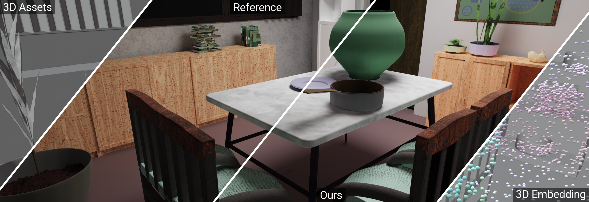

<div align="center">


**ACM SIGGRAPH 2026**

<a href="https://bingxu.tech/projects/2026_lighttransformer/page.html"></a>

<p>
  <a href="https://bingxu.tech/projects/2026_lighttransformer/page.html"><strong>Project page</strong></a> ·
  <a href="https://bingxu.tech/papers/light_transformer_sig_2026.pdf"><strong>Paper</strong></a> ·
  <a href="https://doi.org/10.1145/3799902.3811095"><strong>DOI</strong></a> ·
  <a href="https://github.com/bing-xu-graphics/light_transformer"><strong>Code</strong></a> ·
  <a href="#citation"><strong>BibTeX</strong></a>
</p>

</div>

Code and release assets for the paper.

This repository contains the base model, training and inference code, pretrained weights, a compact test set, and documentation for the scene preparation workflow.

## A note on the original development

The core development behind this project was completed by May 2025, before LLMs and coding agents became as capable as they are today. The released pipeline records the workflow used for the paper. We encourage using coding agents, Blender MCP, and newer procedural tools to build cleaner, more structured, and more varied 3D datasets.

We later found that some surface normals in the paper's procedurally generated training scenes were inherently flipped, causing black areas in some rendered training samples. This issue can now be corrected in Blender before export. New datasets should validate and fix normal orientation during scene preparation. We expect this correction to substantially improve training data quality and, consequently, model quality.

## 🏎️ Contents

- [`src/light_transformer`](src/light_transformer): base model and data loader
- [`train.py`](train.py): training pipeline
- [`infer.py`](infer.py): chunked inference with local decoding
- [`configs/paper.json`](configs/paper.json): model and training settings used for the paper
- [`weights`](weights): pretrained checkpoint tracked with Git LFS, download instructions, and checksum
- [`example_scenes`](example_scenes): processed inputs and references for six scenes from the paper's irradiance comparison, plus the downloadable teaser 3D scene
- [`dataset_helper`](dataset_helper): scene-generation notes and Blender/PBRT preparation workflow
- [`third_party/pointnet2_ops_lib`](third_party/pointnet2_ops_lib): source-only CUDA farthest-point sampling dependency

## 🏎️ Setup

The original training environment used Python 3.10, PyTorch 2.5.1, and CUDA 12.4 on Linux with an NVIDIA GPU.

```bash
conda create -n ltm python=3.10
conda activate ltm
pip install --upgrade pip wheel setuptools
pip install torch==2.5.1 torchvision==0.20.1 torchaudio==2.5.1 \
  --index-url https://download.pytorch.org/whl/cu124
pip install -r requirements-cu124.txt
pip install torch-scatter \
  -f https://data.pyg.org/whl/torch-2.5.1+cu124.html
pip install -e third_party/pointnet2_ops_lib
pip install -e . --no-deps
```

CUDA extensions are compiled for the local GPU during installation.

## 🏎️ Run an example

Fetch the pretrained checkpoint with [Git LFS](https://git-lfs.com/) before running inference:

```bash
git lfs install
git lfs pull
```

See [`weights/README.md`](weights/README.md) for the checkpoint size and checksum.

```bash
python infer.py \
  --scene example_scenes/1accfd5a \
  --checkpoint weights/light_transformer_step350000.ckpt \
  --output prediction.npy
```

The decoder attends only to nearby encoded scene points. Query points are processed in chunks, so output resolution is independent of the number of scene points.

Validate the downloaded checkpoint and included scene arrays with:

```bash
python scripts/validate_release.py
```

## 🏎️ Training

The paper's training defaults are exposed by `train.py`. Dataset paths remain explicit command-line arguments so the release does not contain machine-specific paths.

See [`example_scenes/README.md`](example_scenes/README.md) for the array layout. The released checkpoint includes optimizer state and can resume training with `--resume`.

```bash
python train.py \
  --scenes_list data/train_scene_ids.txt \
  --scenes_dir data/scene_points \
  --query_dir data/query_features \
  --query_field_dir data/query_targets \
  --tb
```

Expected filenames for scene ID `abc123`:

```text
scene_points/scene_abc123_frame_0_data_scene_data.npy
query_features/scene_abc123_frame_0_sampled_data_query_point_feat_0.npy
query_targets/scene_abc123_frame_0_sampled_query_point_irradiance_0.npy
```

Query features and targets use chunk suffixes `0` through `127`. The scene-list file contains one scene ID per line.

## 🏎️ Example data

Raw PBRT training scenes can be 500 MB to 2 GB each and contain upstream generated assets, so the full training set is not redistributed here. The repository provides compact model-ready inputs and reference outputs for selected paper scenes, plus the teaser scene as a separate licensed Release asset. See [`dataset_helper`](dataset_helper) for generating new source scenes.

## 🏎️ Scene generation

The original 3D scenes are stored on the UCSD cluster and are difficult to download and transfer at dataset scale. For most users, it will be faster to run the scene-generation workflow and create new scenes locally. See [`dataset_helper`](dataset_helper) for the setup notes, recorded workflow, and third-party dependencies.

Plan storage before generating a large dataset. At roughly 500 MB to 2 GB per raw scene, 14,000 scenes require about 7 to 28 TB for source data alone. Rendered outputs, processed arrays, logs, and temporary files require additional space. Reserve enough cluster storage or local SSD capacity, with extra working space for interrupted and repeated jobs.

We encourage using coding agents and Blender MCP to improve the workflow, including scene organization, material and lighting checks, surface-normal validation, and support for more varied environments.

The scene-generation pipeline is modular. Feel free to change the source scene representation or renderer interface if another renderer better fits your workflow. To use the released model, convert the results to the scene-point, query-point, and reference-array formats documented in [`example_scenes/README.md`](example_scenes/README.md).

## 🏎️ Third-party projects

The dataset workflow uses external projects but does not redistribute them:

- [Infinigen](https://github.com/princeton-vl/infinigen), used for procedural indoor scene generation
- [io_scene_pbrt](https://github.com/stig-atle/io_scene_pbrt), by Stig Atle Steffensen, used as the basis for Blender-to-PBRT export
- [Falcor](https://github.com/NVIDIAGameWorks/Falcor), used in the rendering and data-generation pipeline

See [`dataset_helper/THIRD_PARTY.md`](dataset_helper/THIRD_PARTY.md) for details.

## 🏎️ Citation

```bibtex
@inproceedings{Xu:2026:LightTransportEmbedding,
  author    = {Bing Xu and Mukund Varma T and Cheng Wang and Tzu-Mao Li and
               Lifan Wu and Bartlomiej Wronski and Ravi Ramamoorthi and Marco Salvi},
  title     = {A Generalizable Light Transport 3D Embedding for Global Illumination},
  booktitle = {ACM SIGGRAPH Conference Papers},
  year      = {2026},
  doi       = {10.1145/3799902.3811095}
}
```
